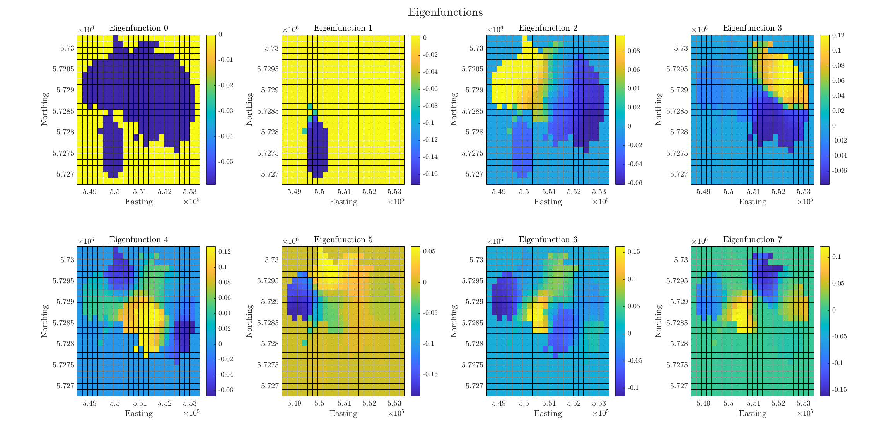
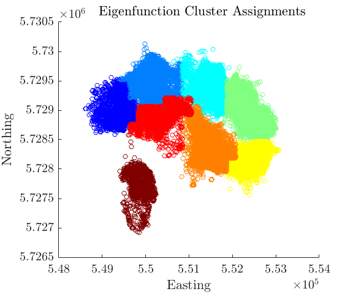
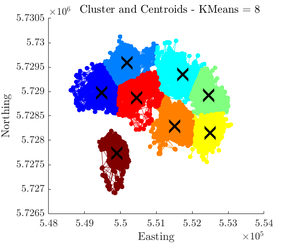

 

&nbsp;

<h1 style="text-align: center;"> Stochastic Models and Experiments in Ecology and Biology (SMEEB) 2024, L' Aquila, Italy  </h1>

<h2 style="text-align: center;"> Abstract </h2>

We investigate a modelling framework to understand the fine-scale movement of the European badger (_Meles meles_) within their environment. It is widely understood that badgers play a crucial role in the transmission of bovine tuberculosis (bTB), where bTB is a serious disease of cattle and has a significant economic impact on farmers. However, despite all the GPS data, ecologists still do not understand what they can learn from the data about fine-scale badger movement. A key research question we would like to answer is can we generate a dynamical model to explore and understand better badger movement?

We model the movements of individual badgers using stochastic particle models on an energy surface. Such an approach has been successful in describing the movements of free-ranging elk and their avoidance of vehicles and humans, but has yet to be applied to the study of badgers. An exploratory modelling framework has been built that describes how badgers move around their landscape foraging, defaecating, and interacting with other badgers (including male and female differences). The model uses data driven methods to parametrize the energy surface using GPS data and the noisy random walks of badgers.

The modelling framework that we have created allow us to answer key ecological questions such as, how does badger movement affect the spread of bTB? With the role badgers play in the spread of bTB, the answer to these questions could be crucial in strategic planning of disease control.

In this presentation, we explore the results of the parameterized model and use it to investigate transition rates between badger social groups, where badgers cross various territories. We also discuss the pros and cons of the generation of an energy surface and the estimation of a noise term. 

---

<h2 style="text-align: center;"> Generated Trajectory </h2>

Below is the animation linked to Figure 3, where the 'badger' can be seen to be moving along its trajectory. The initial position links to an individual badger that is being monitored at the park, and the diffusion term of the badger has been calculated. 

The animation is plotted every two iterations to show a smoother movement of the badger following its trajectory. This is a great tool to have a better visual of the badger movements in the park.

---
<h2 style="text-align: center;"> Extended Dynamic Mode Decomposition </h2>

 This section compliments the box on Extended Dynamic Mode Decomposition (EDMD). For information on EDMD and algorithm, see references [5] and [7]. In essence,the eigenvalues and eigenfunctions of the Koopman Operator capture the long-term dynamics of the observables (for example the coordinates) of the dynamical system. EDMD is used to compute an approximation for the Koopman Operator directly. Then, we analyze the Koopman operator via its spectrum. 

 One requirement for using EDMD is uniformly spaced time intervals. Due to the nature of the GPS collection, unfortunately, we do not have uniform time intervals. We overcome this by interpolating the data. Here, we assume that the badgers are moving in a linear fashion between coordinates, and they are moving the same speed. We need to find a lag time so the space is not too small that we lose the dynamics, and not too large that we are unable to see the dynamics. For example, if we interpolate so we have 2-minute intervals, then we are literally assuming the badgers are moving in a straight line between points A and B. Yet, by reference [6] it is proved by <i> dead reckoning </i> that badgers do not take a linear route. If we use 35-minute intervals, then we are unable to see anything in the results. Hence, we interpolate the data for every 17.5 minutes. Whilst this is assuming we know the position halfway, it gives more ‘freedom’ for the badger between each point. 

<figure>

      <figcaption> <em>Figure</em>. <b>Left</b>: Investigation into interpolating the data for different choices. <b>Right</b>: Figure 3 from [6]. Dead reckoned data of a single badger's movement. </figcaption>

</figure>

 The results using the 17.5 minute interpolated data are presented. The eigenvalues can be seen in Figure 4, and the first eight eigenfunctions that correspond to the first eight eigenvalues are seen below. The eigenfunctions depict where there are energy barriers within the park (i.e. where there are few transitions between areas). 

<figure>

      <figcaption> <em>Figure</em>. The first eight eigenfunctions corresponding to the first eight eigenvalues seen in Figure 4. The first eigenfunction (Eigenfunction 0) is constant, as expected. The second eigenfunction (Eigenfunction 1) highlights there are very few transitions between the bottom and the top of the park. The following eigefunctions highlight where the next energy barriers are within the park. </figcaption>
</figure>

&emsp;

 When we compare the clustered eigenfunctions against the initial k-means clustering of the data we see that the clustering are very similar. (Using optimisation tools, it was shown that eight is the optimal amount of clusters for the data set). One benefit of using EDMD over similar k-means clustering of the data, is that EDMD is looking at the dynamics of the system. Whereas k-means clustering is looking at the Euclidean distance of points to a centroid mean. From this perspective, EDMD is a better representation of the clusters. Yet, the disadvantage is that the data does need to be interpolated to use the method. Nevertheless, through the use of EDMD we are able to see the natual clusters of the park lie. 

<figure>

      <figcaption> <em>Figure</em>. <b>Left</b>: The eight Koopman eigenfunctions clustered using k-means. <b>Right</b>: The original GPS data clustered using k-means clustering. </figcaption>

</figure>

___
<h2 style="text-align: center;"> Transition Probabilities </h2>

 Using the clusters generated with EDMD, we allocate each coordinate (from the 17.5 minute interpolated data) a cluster. Then, we are able to calculate the transition at each time point between the eight clusters. 

<!-- There are eight clusters in total , and we add a ninth state. This state is when the badgers no longer have GPS data, so in essence is a ‘removed’ state from the data. There is no returning to the park once they are in this state, which is why in Figure 5 there are no return arrows to any of the states.  -->
      

 The transition matrix corresponding to Figure 5 is seen below. State 1 starts on the far left and moves up and around the park clockwise, until it reaches the crossing to go to the bottom of the park. As is can be seen, there are very strong probabilities of staying in the original cluster at the next time point, with few transitions to the adjacent cluster. There are no jumps across the park in a single time step. This was to be expected as the clusters are made up of multiple territories, where Figure 1 highlights the territories that were seen within the park in 2018. In 2018, there were 31 territories within the park (although 3 without data in them due to logistics of catching the badgers), however, these can change over time. For instance, boundaries can move and teritories can merge due to the death of a senior/leader badger. The clusters that have been calculated incorporate multiple territories into a single cluster, showing that the badgers stay generally amongst multiple territories, rather than wandering to others. This could have implications if wanting to control the spread of bovine Tuberculosis. 

$$\begin{pmatrix}
0.9719   & 0.0086 & 0                   & 0                    & 0                   & 0                    & 0.01955   & 0                    \\
0.0025 & 0.9892   & 0.0026 & 0                    & 0                   & 0                    & 0.0057  & 0                    \\
0                   & 0.0085 & 0.9708   & 0.0150   & 0                   & 0.0029 & 0.0027  & 0                    \\
0                   & 0                   & 0.0049 & 0.9909    & 0.0037 & 0.0005 & 0                    & 0                    \\
0                   & 0                   & 0                   & 0.0031  & 0.9879   & 0.0090  & 0                    & 0                    \\
0                   & 0                   & 0.0016 & 0.0006 & 0.0200  & 0.9717    & 0.0061  & 0                    \\
0.0139  & 0.0194  & 0.0027 & 0                    & 0                   & 0.0100   & 0.9539    & 0.0002 \\
0                   & 0                   & 0                   & 0                    & 0                   & 0     & 0.0007 & 0.9993   
\end{pmatrix}$$

<!-- $$ \begin{pmatrix} 0.9706 & 0.0086 & 0 & 0 & 0 & 0 & 0.0195 & 0 & 0.0013 \\ 0.0025 & 0.9882 & 0.0026 & 0 & 0 & 0 & 0.0057 & 0 & 0.0010\\ 0 & 0.0085 & 0.9696 & 0.0150 & 0 & 0.0029 & 0.0027 & 0 & 0.00127 \\ 0 & 0 & 0.0048 & 0.9898 & 0.0037 & 0.0005 & 0 & 0 & 0.0011 \\ 0 & 0 & 0 & 0.0031 & 0.9872 & 0.0090 & 0 & 0 & 0.0007 \\ 0 & 0 & 0.0016 & 0.0006 & 0.0200 & 0.9705 & 0.0060 & 0 & 0.0013 \\ 0.0138 & 0.0193 & 0.0027 & 0 & 0 & 0.0100 & 0.9525 & 0.0002 & 0.00150 \\ 0 & 0 & 0 & 0 & 0 & 0 & 0.0007 & 0.9979 & 0.0014 \\ 0 & 0 & 0 & 0 & 0 & 0 & 0 & 0 & 1 \end{pmatrix}  $$ -->

<h2 style="text-align: center;"> Bibliography </h2>

[1] Brillinger, D., Preisler, H., Ager, A., Kie, J., and Service, U. *The use of potential functions in modelling animal movement*. Data Analysis from Statistical Foundations: A Festschrift in Honour of the 75th Birthday of DAS Fraser (05 2001).

[2] Burt, W. H. *Territoriality and home range concepts as applied to mammals*. Journal of Mammalogy 24, 3 (1943),
346–352.

[3] Do Linh San, E., Ferrari, N., and Weber, J.M. *Spatio-temporal ecology and density of badgers meles meles in the swiss jura mountains*. European Journal of Wildlife Research 53 (2007), no. 4, 265–275.

[4] Downs, J., Horner, M., Lamb, D., Loraamm, R. W., Anderson, J., and Wood, B. *Testing time-geographic density estimation for home range analysis using an agent-based model of animal movement*. International Journal of Geographical Information Science 32, 7 (2018), 1505–1522.

[5] Klus, S., Koltai, P., and Schutte, C. *On the numerical approximation of the Perron-Frobenius and Koopman operator*. Journal of Computational Dynamics (2015).

[6] Magowan, E.A., Maguire, I.E., Smith, S., Redpath, S., Marks, N.J., Wilson, R.P., Menzies, F., O’Hagan, M., and Scantlebury, D.M., *Dead-reckoning elucidates fine-scale habitat use by European badgers Meles meles*. Animal Biotelemetry 10 (2022), no. 1, 10.

[7] Niemann, J.H., Klus, S., and Schutte, C., *Data-driven model reduction of agent-based systems using the Koopman generator*. PLOS ONE 16 (2021), no. 5, 1–23.

[8] Preisler, H., Ager, A., Johnson, B., and Kie, J. *Modeling animal movements using stochastic differential equations*. Environmetrics 15636 (11 2004), 643–657.

[9] Preisler, H. K., Ager, A. A., and Wisdom, M. J. *Analyzing animal movement patterns using potential functions*.
Ecosphere 4, 3 (2013), 1–13.

